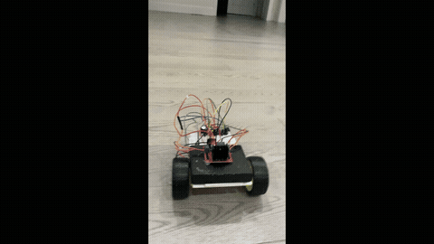

# Gesture-Controlled Robot

A robot car that's driven live by hand gestures — point your thumb left/right/forward/back or hold up an open palm, and the robot responds in real time over WiFi.

| The robot | Live gesture detection |
|---|---|
|  |  |

## How it works

1. A webcam captures your hand.
2. **MediaPipe Hands** detects 21 3D landmark points on the hand for every frame.
3. A small classifier (scikit-learn `MLPClassifier`) trained on those landmark coordinates predicts which gesture you're making — `Forward`, `Backward`, `Left`, `Right`, or `Stop`.
4. Predictions are smoothed with a majority-vote filter across recent frames, so a single flickered/misread frame doesn't jerk the robot around.
5. The resulting command is sent over WiFi to an **ESP32**, which drives two gearbox motors through an **L298N** motor driver to move the robot.

## Why landmarks instead of a raw image classifier

The first version of this project used a MobileNetV2-based CNN trained directly on photos. It struggled specifically with telling **Left** and **Right** apart — `GlobalAveragePooling2D` discards a lot of spatial/positional information, and Left/Right pointing is fundamentally a positional distinction, not an object-identity one (which is what MobileNetV2 was pretrained for).

Switching to MediaPipe's hand landmarks solved this directly: instead of learning from raw pixels, the classifier learns from exact (x, y, z) coordinates of the hand, so "which way is the thumb pointing relative to the wrist" becomes trivial to separate. It's also far lighter — training takes under a second instead of minutes, since the input is 63 numbers instead of a full image.

## Project files

| File | Purpose |
|---|---|
| `extract_landmarks.py` | Runs MediaPipe over a folder of labeled gesture photos and extracts hand landmarks into a CSV dataset |
| `gesture_data.csv` | The extracted landmark dataset (one row per photo, 63 landmark values + label) |
| `train_classifier.py` | Trains the `MLPClassifier` on the landmark dataset and saves it |
| `gesture_classifier.pkl` | The trained gesture classifier |
| `control.py` | Live webcam script: detects hand → predicts gesture → smooths predictions → sends commands to the ESP32 over WiFi |
| `espCode.ino` | Arduino sketch for the ESP32 — connects to WiFi, listens for commands, and drives the L298N motor driver |

## Hardware

- ESP32 dev board
- L298N motor driver
- 2x gearbox motors (differential drive)
- 1x front caster wheel

### Wiring (L298N → ESP32)

| L298N Pin | ESP32 GPIO |
|---|---|
| IN1 | 16 |
| IN2 | 4 |
| IN3 | 23 |
| IN4 | 22 |
| ENA | 17 |
| ENB | 21 |
| GND | GND |
| 12V / motor power | External battery (not ESP32 5V) |

> Note: GPIO0, GPIO2, and GPIO15 are ESP32 boot-strapping pins and are best avoided for motor control outputs — using them caused an intermittent motor dropout during development, fixed by moving to GPIO22/23/21 instead.

## Setup

### 1. Collect gesture photos
Take photos of each gesture and sort them into folders named after the gesture (`Forward/`, `Backward/`, `Left/`, `Right/`, `Stop/`).

### 2. Extract landmarks
```bash
pip install mediapipe opencv-python
python extract_landmarks.py
```

### 3. Train the classifier
```bash
pip install scikit-learn pandas joblib
python train_classifier.py
```

### 4. Flash the ESP32
Open `espCode.ino` in the Arduino IDE, fill in your WiFi SSID/password, upload it, and note the IP address printed in the Serial Monitor.

### 5. Run live control
Update `ESP32_IP` in `control.py` to match, then:
```bash
python control.py
```

Press `q` to quit (sends a final STOP command for safety).

## Notes

- Recommended to use a Python virtual environment — MediaPipe and TensorFlow-based tools can conflict on `protobuf` versions if mixed in the same environment.
- Motor speeds (`LEFT_SPEED`, `RIGHT_SPEED`, `TURN_SPEED`) may need per-robot tuning, since even identical motor models can vary slightly in real-world speed at the same PWM value.
